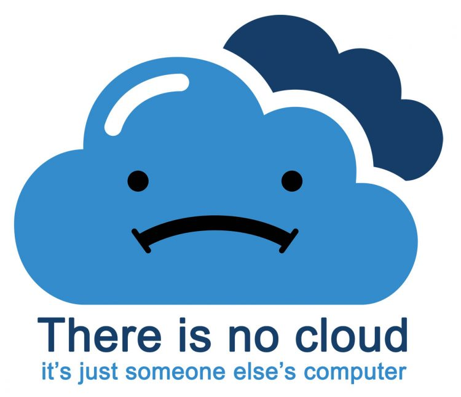

# Files! <!-- _class: title -->

# But I thought this was an HTML class...
File organization is going to be incredibly important for this course

-> And particularly important for tomorrow's new concept

File management is an important topic for *anyone who uses technology*

# Let's start from the basics:
A **file** is a document stored in a computer system. This document could be an essay, an image, a program, a video, an audio file, etc.

Files are stored on a computer, or other computing device (like a flash drive)

# File Sizes
We typically measure file sizes in megabytes (MB) and gigabytes (GB). 

> 1GB = 1000ish MB

Your MacBook has 128GB of storage space.

# Storing Files on my Computer
Good news -- your MacBook can store files! We call this *local storage*.

As a matter of fact, MacOS is comprised of hundreds of thousands of files... Apps, configuration files, drivers, images, sounds, and more. 

As a user, you'll probably be storing files in the following places:
* Documents
* Downloads
* Desktop
* Photos
* Music
* Etc.

# The Downside of Local Storage
I have important files on my computer

I break my computer. I throw it away. 

I've just thrown away my important files.

:(

# The Solution
So where do we put files that we don't want to lose? 
Or files that we want to access from anywhere? 

The cloud!

# So what's that cloud thing?

# The Cloud
When we store files in the cloud, we are really saving our file on an internet-connected computer called a *server*. 

Since the server is connected to the internet, we can log in and get, change, or delete our file from any other device, as long as that device is connected to the internet as well.

**If a file lives in the cloud, it is not stored on our computer.**
**If a file lives on our computer, it is not stored in the cloud.**

# Organizing Files
